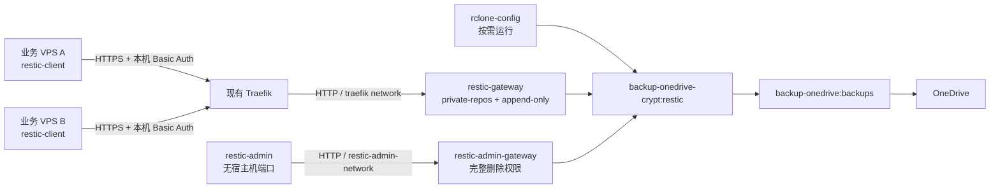

# 多 VPS 集中备份系统执行手册 v1.0

> 状态：完整部署模板，含待确认参数。所有 `CHANGE_ME` 必须在执行对应步骤前替换。
> 中央根路径：`/data/restic-gateway`
> 中央 Compose 项目：`restic-gateway`
> 公共网关：`restic-gateway`
> 管理网关：`restic-admin-gateway`
> 管理容器：`restic-admin`
> 时区：`Asia/Shanghai`
> 运行 UID/GID：`10001:10001`

## 1. 手册使用规则

本手册用于在中央 VPS 和各业务 VPS 上部署可自动运行、可集中维护、可恢复验证的 restic 备份系统。

执行时遵守以下规则：

1. 不把 OneDrive OAuth、`rclone.conf`、crypt password、crypt salt、管理 REST 密码下发到业务 VPS。
2. 公共网关始终使用 `--private-repos` 和 `--append-only`。
3. 管理网关始终与公共网关同时在线，不通过 Traefik、不发布宿主机端口。
4. 业务 VPS 只保存本机公共 REST 密码和本机仓库密码。
5. `rclone.conf` 必须保持读写挂载，以允许 OneDrive token 刷新。
6. 不重复执行已经完成的 `rclone config encryption set`。
7. 所有自动保留策略必须包含非空的 `KEEP_WITHIN`。不能只使用 `keep-last`、日、周、月、年世代。
8. 不自动执行 `restic unlock`。出现锁错误时先确认没有活动备份、检查或 prune。
9. 其他存储服务不进入本期架构。
10. 本期新增镜像均使用 `latest`，但每次部署和更新后必须记录实际版本与镜像 digest。

## 2. 尚未确认的阻断参数

以下参数没有最终值。本手册提供配置位置，但不替用户决定：

| 参数 | 配置位置 | 启用前检查 |
|---|---|---|
| 公共备份域名 | 中央 `.env`、客户端 `.env` | DNS 已指向中央 VPS，TLS 正常 |
| 少数 VPS 的额外备份源 | 客户端 Compose | 默认 `/data`、`/etc`、`/root` 之外的源已确认且只读挂载 |
| 数据库一致性 dump | 各 VPS 的应用维护脚本 | 已确定各数据库的 dump 命令和失败策略 |
| 客户端备份时间 | `restic-backup.timer` | `systemd-analyze calendar` 验证通过 |
| 客户端随机延迟 | `restic-backup.timer` | 已确认允许的延迟窗口 |
| 保留数量与窗口 | 中央 `.env` | 所有 `KEEP_*` 已填，`KEEP_WITHIN` 非空 |
| forget/prune 周期 | `restic-maintenance.timer` | 不与已知高峰维护窗口冲突 |
| check 周期与比例 | 中央 `.env`、`restic-check.timer` | 比例格式通过 restic 验证 |
| 其余 VPS 名称 | `hosts.txt` 和凭据目录 | 不得写入字面量 `...` |

只要上述参数未确认，就可以部署网关并做手动测试，但不能宣称“自动备份和自动维护验收完成”。

### 2.1 所有占位符示例

下表只说明格式，示例不是已经确认的生产值：

| 占位符 | 可填写示例 | 含义 |
|---|---|---|
| `CHANGE_ME_BACKUP_DOMAIN` | `backup.example.com` | 公共备份域名，不带 `https://` |
| `CHANGE_ME_TRAEFIK_ENTRYPOINT` | `websecure` | 现有 Traefik HTTPS entrypoint |
| `CHANGE_ME_KEEP_LAST` | `7` | 至少保留最近 7 个快照 |
| `CHANGE_ME_KEEP_DAILY` | `14` | 保留 14 个每日世代 |
| `CHANGE_ME_KEEP_WEEKLY` | `8` | 保留 8 个每周世代 |
| `CHANGE_ME_KEEP_MONTHLY` | `12` | 保留 12 个每月世代 |
| `CHANGE_ME_KEEP_YEARLY` | `2` | 保留 2 个年度世代 |
| `CHANGE_ME_KEEP_WITHIN` | `14d` | 最近 14 天的全部快照都保留 |
| `CHANGE_ME_CHECK_READ_DATA_SUBSET` | `5%` | 每次 check 读取约 5% 仓库数据 |
| `CHANGE_ME_MAINTENANCE_ON_CALENDAR` | `Sun *-*-* 04:00:00` | 每周日 04:00 进入维护触发点 |
| `CHANGE_ME_MAINTENANCE_RANDOM_DELAY` | `2h` | 在触发点后随机延迟 0～2 小时 |
| `CHANGE_ME_CHECK_ON_CALENDAR` | `Sat *-*-* 04:00:00` | 每周六 04:00 进入检查触发点 |
| `CHANGE_ME_CHECK_RANDOM_DELAY` | `2h` | 检查随机延迟上限 2 小时 |
| `CHANGE_ME_BACKUP_ON_CALENDAR` | `*-*-* 02:00:00` | 每天 02:00 进入备份触发点 |
| `CHANGE_ME_BACKUP_RANDOM_DELAY` | `4h` | 各 VPS 分散在 02:00～06:00 启动 |
| `CHANGE_ME_HOSTNAME` | `vps-example-01` | 必须与中央用户名及路径完全一致 |
| `CHANGE_ME_PUBLIC_REPOSITORY_URL` | `rest:https://backup.example.com/vps-example-01/` | 本机公共仓库 URL |

本项目统一使用 `Asia/Shanghai`，所以上述未带时区后缀的 `OnCalendar` 示例按上海时间解释。`RandomizedDelaySec` 是最大随机延迟，不是固定延迟。

## 3. 本版采用的固定技术名称

为保证模板能够直接落盘，本版使用以下名称：

| 对象 | 固定值 |
|---|---|
| Compose 项目 | `restic-gateway` |
| 公共网关服务 | `restic-gateway` |
| 管理网关服务 | `restic-admin-gateway` |
| 管理容器服务 | `restic-admin` |
| rclone 工具服务 | `rclone-config` |
| 长期容器名称 | `restic-gateway`、`restic-admin-gateway`、`restic-admin`、`restic-client`、`socket-proxy` |
| 外部 Traefik network | `traefik` |
| 管理 bridge | `restic-admin-network` |
| 管理 REST 用户名 | `restic-admin` |
| rclone remote | `backup-onedrive-crypt:restic` |
| crypt 底层目录 | `backup-onedrive:backups` |
| 公共 htpasswd | `auth/public.htpasswd` |
| 管理 htpasswd | `auth/admin.htpasswd` |
| 公共密码文件 | `credentials/public/<host>.http-password` |
| 仓库密码文件 | `credentials/repositories/<host>.repository-password` |
| 仓库 URL 文件 | `repositories/<host>.repository-url` |

首次生产部署后不得无理由改名。

长期服务使用与服务名一致的固定 `container_name`。`rclone-config` 由 `docker compose run --rm` 按需创建，不设置固定容器名，以免一次性工具运行发生名称冲突。固定容器名意味着这些服务按设计只能单实例运行。

## 4. 系统拓扑



网络边界：

| 服务 | `traefik` | `restic-admin-network` | 宿主机端口 |
|---|---:|---:|---:|
| `restic-gateway` | 是 | 否 | 无 |
| `restic-admin-gateway` | 否 | 是 | 无 |
| `restic-admin` | 否 | 是 | 无 |
| `rclone-config` | 否 | 是 | 无 |

`restic-admin-network` 不能设置 `internal: true`，否则 rclone 无法访问 OneDrive。

## 5. 交付包内容

当前交付包包含：

```text
central/
├── compose.yaml
├── .env.example
├── hosts.example.txt
├── auth/
├── credentials/
│   ├── public/
│   └── repositories/
├── rclone/
├── repositories/
├── restore/
├── secrets/
├── scripts/
│   ├── run-restic.sh
│   ├── init-repository.sh
│   ├── init-all-repositories.sh
│   ├── maintain-all.sh
│   └── check-all.sh
└── systemd/
    ├── restic-maintenance.service
    ├── restic-maintenance.timer.template
    ├── restic-check.service
    └── restic-check.timer.template

client/
├── compose.yaml
├── .env.example
├── config/
│   └── excludes.txt
├── scripts/
│   ├── backup.sh
│   └── restic-command.sh
├── secrets/
└── systemd/
    ├── restic-backup.service
    └── restic-backup.timer.template

traefik/
├── socket-proxy-compose-fragment.yaml
└── socket-proxy-haproxy.cfg
```

生产中央节点落盘后完整结构为：

```text
/data/restic-gateway/
├── compose.yaml
├── .env
├── hosts.txt
├── rclone/rclone.conf
├── auth/public.htpasswd
├── auth/admin.htpasswd
├── secrets/rclone-config-password
├── credentials/admin.http-password
├── credentials/public/<host>.http-password
├── credentials/repositories/<host>.repository-password
├── repositories/<host>.repository-url
├── scripts/
├── restore/
├── locks/
└── systemd/
```

`/etc/systemd/system` 只保存 systemd 必需的 unit 文件。项目源文件、脚本和状态仍统一保存在 `/data/restic-gateway`。

中央 Compose 只声明两个固定 secret：`rclone-config-password` 和 `admin-http-password`。Compose secrets 不支持目录或通配符，因此各仓库独立密码统一保存在 `credentials/repositories/`，以 `0400` 文件权限和只读目录挂载仅提供给 `restic-admin`。`credentials/public/` 不挂载进任何中央容器。

## 6. 中央 VPS 部署

### 6.1 部署前检查

以 root 登录中央 VPS：

```bash
sudo -i
docker version
docker compose version
systemctl --version
flock --version
openssl version
timedatectl status
```

检查现有 Traefik network：

```bash
docker network inspect traefik
```

如果不存在，停止执行。先核实现有 Traefik Compose 使用的真实 network 名称；不要擅自新建一个同名但未被 Traefik 使用的网络。

统一时区：

```bash
timedatectl set-timezone Asia/Shanghai
timedatectl status
timedatectl show -p NTPSynchronized
```

`NTPSynchronized` 必须为 `yes`。若为 `no`，先修复主机的 NTP/时间同步，再启用维护任务。append-only 仓库的 `KEEP_WITHIN` 安全窗口依赖可信系统时间。

### 6.2 安装中央目录

先将交付包的 `central` 目录上传到中央 VPS，例如上传到 `/root/vps-backup-package/central`，然后执行：

```bash
sudo -i
install -d -o 10001 -g 10001 -m 0750 /data/restic-gateway
cp -a /root/vps-backup-package/central/. /data/restic-gateway/
cd /data/restic-gateway
mv .env.example .env
cp hosts.example.txt hosts.txt
install -d -o 10001 -g 10001 -m 0750 auth credentials credentials/public credentials/repositories locks rclone repositories restore scripts secrets systemd
```

编辑 `hosts.txt`，用真实完整清单替换两个示例名，然后确认内容：

```bash
nano /data/restic-gateway/hosts.txt
cat /data/restic-gateway/hosts.txt
if grep -En '^(\.\.\.|vps-example-[0-9]+)$' /data/restic-gateway/hosts.txt; then
  echo '错误：hosts.txt 仍含占位内容' >&2
  exit 1
fi
```

预期当前有 14 行有效主机名。

### 6.3 填写中央 `.env`

编辑：

```bash
nano /data/restic-gateway/.env
```

必须保持：

```dotenv
PUID=10001
PGID=10001
TZ=Asia/Shanghai
RCLONE_REMOTE=backup-onedrive-crypt:restic
RESTIC_ADMIN_USERNAME=restic-admin
```

填写现有 Traefik 的真实值：

```dotenv
BACKUP_DOMAIN=<公共备份域名>
TRAEFIK_ENTRYPOINT=<现有 HTTPS entrypoint 名称>
```

本项目使用 Traefik 已加载的泛域名证书，不配置 `tls.certresolver`。必须确认泛域名证书覆盖公共备份域名，并已进入 Traefik TLS certificate store。

保留数量尚未确认时可以暂时保留 `CHANGE_ME`，但不能安装或启用维护 timer。

检查敏感信息：`.env` 中不得出现 OneDrive token、crypt password、rclone 配置密码、REST 明文密码或仓库密码。

### 6.4 放置并保护 `rclone.conf`

将当前已经配置好的加密 `rclone.conf` 安全复制到：

```text
/data/restic-gateway/rclone/rclone.conf
```

设置权限：

```bash
chown 10001:10001 /data/restic-gateway/rclone
chmod 0750 /data/restic-gateway/rclone
chown 10001:10001 /data/restic-gateway/rclone/rclone.conf
chmod 0600 /data/restic-gateway/rclone/rclone.conf
```

Compose 必须把整个宿主机目录以读写方式挂载：

```yaml
- ./rclone:/config/rclone:rw
```

不能只挂载 `rclone.conf` 文件。rclone 保存 OAuth token 时会先在相同目录创建 `rclone.conf<随机数字>` 临时文件，再原子替换原配置；因此容器用户 `10001` 必须能写 `/config/rclone` 目录。不要把目录或文件设为只读。

### 6.5 写入 rclone 配置加密密码

不得把密码写入 `.env` 或命令行。交互式写入 Compose secret 源文件：

```bash
cd /data/restic-gateway
umask 077
read -r -s -p '输入现有 rclone.conf 配置加密密码: ' RCLONE_CONFIG_PASSWORD
printf '\n'
printf '%s\n' "$RCLONE_CONFIG_PASSWORD" > secrets/rclone-config-password
unset RCLONE_CONFIG_PASSWORD
chown 10001:10001 secrets/rclone-config-password
chmod 0400 secrets/rclone-config-password
```

不再创建单独的 `rclone-password-command` 脚本。Compose 直接设置：

```yaml
RCLONE_PASSWORD_COMMAND: /bin/cat /run/secrets/rclone-config-password
```

加密的 `rclone.conf` 仍需要 password command 才能无交互解密。这里的环境变量只包含读取 secret 的命令和文件路径，不包含真实密码。

### 6.6 生成中央管理凭据和各仓库凭据

生成管理 REST 密码：

```bash
cd /data/restic-gateway
umask 077
test -s credentials/admin.http-password || openssl rand -hex 32 > credentials/admin.http-password
```

为 `hosts.txt` 中每台主机分别生成公共 REST 密码和仓库密码：

```bash
cd /data/restic-gateway
umask 077
while IFS= read -r host; do
  case "$host" in ''|'#'*) continue ;; esac
  test -s "credentials/public/${host}.http-password" || openssl rand -hex 32 > "credentials/public/${host}.http-password"
  test -s "credentials/repositories/${host}.repository-password" || openssl rand -hex 32 > "credentials/repositories/${host}.repository-password"
done < hosts.txt
chown 10001:10001 credentials/admin.http-password credentials/public/* credentials/repositories/*
chmod 0400 credentials/admin.http-password credentials/public/* credentials/repositories/*
```

禁止复用公共 REST 密码和仓库密码。

### 6.7 创建 bcrypt htpasswd

本步骤使用 `httpd:latest` 中的 `htpasswd`，密码通过标准输入传入，不出现在命令参数中。

创建公共 htpasswd：

```bash
cd /data/restic-gateway
install -o 10001 -g 10001 -m 0600 /dev/null auth/public.htpasswd.new
while IFS= read -r host; do
  case "$host" in ''|'#'*) continue ;; esac
  docker run --rm -i \
    --user 10001:10001 \
    -v /data/restic-gateway/auth:/auth \
    httpd:latest \
    htpasswd -iB /auth/public.htpasswd.new "$host" \
    < "credentials/public/${host}.http-password"
done < hosts.txt
mv auth/public.htpasswd.new auth/public.htpasswd
chmod 0640 auth/public.htpasswd
chown 10001:10001 auth/public.htpasswd
```

创建管理 htpasswd：

```bash
cd /data/restic-gateway
install -o 10001 -g 10001 -m 0600 /dev/null auth/admin.htpasswd.new
docker run --rm -i \
  --user 10001:10001 \
  -v /data/restic-gateway/auth:/auth \
  httpd:latest \
  htpasswd -iB /auth/admin.htpasswd.new restic-admin \
  < credentials/admin.http-password
mv auth/admin.htpasswd.new auth/admin.htpasswd
chmod 0640 auth/admin.htpasswd
chown 10001:10001 auth/admin.htpasswd
```

确认文件中没有明文密码：

```bash
head -n 2 auth/public.htpasswd
cat auth/admin.htpasswd
```

每行应为 `用户名:$2...` 形式的 bcrypt 哈希。

### 6.8 创建仓库 URL 文件

管理容器通过 Docker 内部 DNS 访问管理网关：

```bash
cd /data/restic-gateway
while IFS= read -r host; do
  case "$host" in ''|'#'*) continue ;; esac
  printf 'rest:http://restic-admin-gateway:8080/%s/\n' "$host" > "repositories/${host}.repository-url"
done < hosts.txt
chown 10001:10001 repositories/*.repository-url
chmod 0640 repositories/*.repository-url
```

抽查：

```bash
cat repositories/vps-example-01.repository-url
```

预期：

```text
rest:http://restic-admin-gateway:8080/vps-example-01/
```

### 6.9 统一文件权限

```bash
cd /data/restic-gateway
chown 10001:10001 compose.yaml .env hosts.txt
chmod 0640 compose.yaml .env hosts.txt
chown -R 10001:10001 scripts systemd restore locks
chown 10001:10001 credentials credentials/public credentials/repositories
find scripts -type f -exec chmod 0550 {} \;
find systemd -type f -exec chmod 0640 {} \;
chmod 0750 auth credentials credentials/public credentials/repositories locks rclone repositories restore scripts secrets systemd
```

不得执行会把 secret 改成全局可读的 `chmod -R 755` 或 `chmod -R 777`。

### 6.10 检查 rclone 配置和 remote

先确认外部 Traefik network 存在，然后运行工具服务：

```bash
cd /data/restic-gateway
docker compose --profile tools run --rm rclone-config config encryption check
docker compose --profile tools run --rm rclone-config listremotes
```

`listremotes` 必须包含且只按既定名称使用：

```text
backup-onedrive:
backup-onedrive-crypt:
```

检查底层和 crypt remote：

```bash
docker compose --profile tools run --rm rclone-config lsd backup-onedrive:backups
docker compose --profile tools run --rm rclone-config lsd backup-onedrive-crypt:
```

如果输出：

```text
Read password using --password-command
```

表示 rclone 已通过 password command 读取配置密码，不是错误。

只有 `config encryption check` 明确表明配置未加密时，才执行：

```bash
docker compose --profile tools run --rm -it rclone-config config encryption set
```

已经加密时禁止重复执行。

如果必须从头重建 remote，应使用选项名称而不是依赖可能变化的菜单编号：

1. 创建名为 `backup-onedrive` 的 OneDrive remote。
2. 完成 Microsoft OAuth 授权并确认能列出目标 drive。
3. 创建名为 `backup-onedrive-crypt` 的 crypt remote。
4. crypt 的底层 remote 填写 `backup-onedrive:backups`。
5. 启用标准文件名加密和目录名加密。
6. 保存 crypt password 和 salt 到离线安全位置。
7. 设置并检查 `rclone.conf` 配置加密。

不得把 restic 网关指向 `backup-onedrive:backups`；网关只能使用 `backup-onedrive-crypt:restic`。

## 7. Traefik Docker socket proxy 改造

### 7.1 改造范围

Traefik 保持在原 Compose 项目中。本步骤不把 Traefik 移入 `/data/restic-gateway/compose.yaml`。

将交付包中的 `traefik/socket-proxy-compose-fragment.yaml` 合并到现有 Traefik Compose，并把 `traefik/socket-proxy-haproxy.cfg` 复制到该 Compose 项目目录。不能直接用片段覆盖现有文件。

socket proxy 使用：

```text
lscr.io/linuxserver/socket-proxy:latest
```

LinuxServer 镜像原生的 `CONTAINERS=1` 会开放整个 `/containers` GET 命名空间，其中包括 archive、export、logs 等 Traefik 不需要的读取接口；`ALLOW_RESTARTS=1` 还会在 `POST=0` 时继续允许任意容器的 stop、restart 和 kill。因此本方案不使用这两个分组开关，而是只读挂载自定义 HAProxy ACL 模板。

ACL 仅允许：

- Docker provider 所需的 ping、version、info、events、容器列表/inspect、网络列表/inspect。
- 对一个固定 Traefik 容器执行 `POST /containers/<name>/kill?signal=USR1`。

archive、export、logs、stats、stop、restart、exec 及其他 Docker API 请求均返回拒绝。

先在现有 Traefik Compose 项目的 `.env` 中填写固定容器名。例如实际容器名确为 `traefik` 时：

```dotenv
TRAEFIK_CONTAINER_NAME=traefik
```

该名称只能包含 ASCII 字母、数字、下划线和连字符。若当前名称含其他字符，为 Traefik 服务设置一个满足规则的稳定 `container_name`，再填写完全一致的值。部署前验证：

```bash
set -a
. ./.env
set +a
case "$TRAEFIK_CONTAINER_NAME" in
  ''|*[!A-Za-z0-9_-]*) echo '错误：TRAEFIK_CONTAINER_NAME 格式无效' >&2; exit 1 ;;
esac
docker inspect "$TRAEFIK_CONTAINER_NAME" >/dev/null
```

### 7.2 修改现有 Traefik 服务

从 Traefik 服务中删除：

```yaml
- /var/run/docker.sock:/var/run/docker.sock:ro
```

把 Docker provider endpoint 改为：

```text
tcp://socket-proxy:2375
```

如果使用 Traefik 静态 YAML：

```yaml
providers:
  docker:
    endpoint: tcp://socket-proxy:2375
```

如果使用命令参数：

```yaml
- --providers.docker.endpoint=tcp://socket-proxy:2375
```

Traefik 必须同时保留原有 `traefik` network，并新增 `socket-proxy-network`。

### 7.3 修改现有 `traefik-logrotate`

保留原有日志文件挂载、轮转规则和轮转后重新打开日志的动作，只修改 Docker 访问方式：

```yaml
environment:
  DOCKER_HOST: tcp://socket-proxy:2375
  TRAEFIK_CONTAINER_NAME: ${TRAEFIK_CONTAINER_NAME:?set the exact Traefik container name}
networks:
  - socket-proxy-network
```

删除其直接 Docker socket 挂载。轮转后仍需执行等价于：

```bash
docker kill --signal USR1 "$TRAEFIK_CONTAINER_NAME"
```

### 7.4 验证 socket proxy

在 Traefik 项目目录执行：

```bash
docker compose config
docker compose pull socket-proxy
docker compose run --rm --no-deps --entrypoint /bin/sh socket-proxy -c \
  'sed "s/@@BIND_PROTO@@/:2375/g" /templates/haproxy.cfg >/run/haproxy-test.cfg && haproxy -c -f /run/haproxy-test.cfg'
docker compose up -d socket-proxy traefik traefik-logrotate
docker compose ps
docker compose logs --tail=100 socket-proxy traefik
```

HAProxy 检查必须显示配置有效。随后从已有 Docker CLI 的 `traefik-logrotate` 容器验证拒绝规则；以下命令只尝试读取 Traefik 容器内非敏感的 `/etc/hostname`：

```bash
if docker compose exec -T traefik-logrotate sh -c \
  'rm -f /tmp/socket-proxy-deny-test && docker cp "${TRAEFIK_CONTAINER_NAME}:/etc/hostname" /tmp/socket-proxy-deny-test'; then
  echo '错误：socket proxy 未拒绝 archive/cp 请求' >&2
  exit 1
fi

if docker compose exec -T traefik-logrotate sh -c \
  'docker kill --signal CONT "$TRAEFIK_CONTAINER_NAME"'; then
  echo '错误：socket proxy 未拒绝非 USR1 信号' >&2
  exit 1
fi
```

两项都必须被拒绝。不要用 stop/restart 作为拒绝测试，避免 ACL 配置错误时真的中断 Traefik。

检查 Traefik 已重新发现现有容器路由。手动触发一次现有日志轮转流程，然后确认：

1. Traefik 容器没有重启或退出。
2. Traefik 日志文件被重新打开并继续写入。
3. Traefik 和 logrotate 已不再直接挂载 `/var/run/docker.sock`。
4. `docker cp` 和非 `USR1` 信号测试都被 socket proxy 拒绝。

若 Traefik 无法发现容器，检查 provider endpoint、network、socket proxy 日志及 ACL；不要为了通过测试而重新启用 `CONTAINERS=1` 或 `ALLOW_RESTARTS=1`。在路由失效或拒绝测试失败时，不要继续部署公共网关。

## 8. 启动中央备份系统

### 8.1 Compose 静态检查

```bash
cd /data/restic-gateway
docker compose config
```

必须确认：

- `x-rclone-base` 仍存在。
- 三个 rclone 服务均继承 `<<: *rclone-base`。
- `restic-gateway` 只加入 `traefik`。
- `restic-admin-gateway`、`restic-admin` 只加入 `restic-admin-network`。
- 三个中央长期服务的 `container_name` 与服务名一致。
- 没有任何服务挂载 Docker socket。
- 没有 `ports:` 发布管理端口。
- `rclone` 整个目录在三个 rclone 服务中均挂载为 `/config/rclone:rw`，不是只挂载单个 `rclone.conf` 文件。
- `rclone-config-password` 只挂载给 rclone 服务。
- `admin.http-password` 只以 Compose secret 挂载给 `restic-admin`。
- `credentials/repositories` 只读挂载给 `restic-admin`，公共 HTTP 密码目录未挂载。
- 公共网关存在 `--private-repos` 和 `--append-only`。
- 管理网关没有 `--append-only`。

检查 Compose 中是否仍有未定义变量：

```bash
docker compose config 2>&1 | grep -i 'variable.*not set' && echo '错误：存在未定义变量'
```

### 8.2 拉取并记录镜像

```bash
cd /data/restic-gateway
docker compose pull
docker image inspect rclone/rclone:latest --format '{{.RepoDigests}}'
docker image inspect restic/restic:latest --format '{{.RepoDigests}}'
```

把输出记录到变更记录。`latest` 不会自动替换正在运行的容器；更新时仍需显式 `pull` 和 `up -d`。

### 8.3 启动三个长期服务

```bash
cd /data/restic-gateway
docker compose up -d restic-gateway restic-admin-gateway restic-admin
docker compose ps
```

`rclone-config` 是按需工具，不应长期启动。

检查日志：

```bash
docker compose logs --tail=100 restic-gateway
docker compose logs --tail=100 restic-admin-gateway
docker compose logs --tail=100 restic-admin
```

验证两个网关容器能在配置目录执行 rclone 所需的“创建临时文件并原子改名”操作：

```bash
for service in restic-gateway restic-admin-gateway; do
  docker compose exec -T "$service" sh -c '
    test_file=/config/rclone/.rclone-write-test.$$
    moved_file=${test_file}.moved
    printf test > "$test_file"
    mv "$test_file" "$moved_file"
    rm -f "$moved_file"
  '
done
```

命令必须全部返回 0。若出现 `permission denied`，不要等待 token 自动刷新；立即检查宿主机 `rclone` 目录属主、0750 权限和目录级 bind mount。

### 8.4 验证网络和端口边界

```bash
cd /data/restic-gateway
for service in restic-gateway restic-admin-gateway restic-admin; do
  id=$(docker compose ps -q "$service")
  printf '%s: ' "$service"
  docker inspect --format '{{range $name, $value := .NetworkSettings.Networks}}{{printf "%s " $name}}{{end}}' "$id"
  printf '\n'
  docker port "$id"
done
```

预期：

- `restic-gateway` 只显示 `traefik`。
- 管理两个服务只显示项目管理 bridge。
- 三个服务的 `docker port` 均无输出。

检查管理服务没有 Traefik labels：

```bash
docker inspect "$(docker compose ps -q restic-admin-gateway)" --format '{{json .Config.Labels}}'
docker inspect "$(docker compose ps -q restic-admin)" --format '{{json .Config.Labels}}'
```

### 8.5 验证公共域名

等待 DNS 生效，并确认 Traefik 已为该域名选择现有泛域名证书：

```bash
curl -sS -o /dev/null -w '%{http_code}\n' "https://${BACKUP_DOMAIN}/vps-example-01/"
```

如果当前 shell 没有读取 `.env`，先手动将 `${BACKUP_DOMAIN}` 替换为真实域名。

未携带 Basic Authentication 时预期返回 `401`。如果直接得到成功响应，停止部署并检查是否错误地让 Traefik 代替 rclone 处理认证，或公共网关是否漏掉 `--htpasswd`。

## 9. 初始化所有 restic 仓库

仓库初始化通过内部管理网关完成，不能把管理凭据下发到客户端。

单台初始化命令是幂等的：仓库已存在且能够用对应密码读取配置时，会显示“仓库已存在，跳过初始化”并返回成功，不会覆盖仓库。

```bash
cd /data/restic-gateway
docker compose exec -T restic-admin /scripts/init-repository.sh vps-example-01
```

批量初始化全部 `hosts.txt` 主机：

```bash
cd /data/restic-gateway
docker compose exec -T restic-admin /scripts/init-all-repositories.sh
```

批量脚本在容器内部读取 `/config/hosts.txt`，不会让 `docker compose exec` 与宿主机循环争用 stdin。已存在仓库按成功跳过；单个仓库失败会记录错误并继续后续主机；全部处理完成后，只要存在失败项，整体返回非零。

使用以下命令抽查已有仓库：

```bash
docker compose exec -T restic-admin /scripts/run-restic.sh vps-example-01 cat config
docker compose exec -T restic-admin /scripts/run-restic.sh vps-example-01 snapshots
```

若出现 `401 Unauthorized`：

1. 检查 `RESTIC_ADMIN_USERNAME=restic-admin`。
2. 检查 `credentials/admin.http-password` 与 `auth/admin.htpasswd` 是否对应。
3. 重新创建 `restic-admin` 以刷新 `admin.http-password` Compose secret。

```bash
docker compose up -d --force-recreate restic-admin
```

若出现 repository not found，检查 `<host>.repository-url`、`credentials/repositories/<host>.repository-password` 和管理网关日志。

## 10. 配置自动维护与检查

### 10.1 填写保留策略

在用户明确确认后，编辑 `/data/restic-gateway/.env`：

```dotenv
KEEP_LAST=<已确认整数>
KEEP_DAILY=<已确认整数>
KEEP_WEEKLY=<已确认整数>
KEEP_MONTHLY=<已确认整数>
KEEP_YEARLY=<已确认整数>
KEEP_WITHIN=<已确认时间窗口，例如 Nd 或 Nm；不得照抄示例>
CHECK_READ_DATA_SUBSET=<已确认比例，例如 N% 或 N/M；不得照抄示例>
```

安全要求：`KEEP_WITHIN` 必须存在。restic 官方 append-only 安全说明指出，如果只保留“最新若干”或日/周/月世代，被攻陷客户端可以上传大量伪造的新快照，使合法快照不再满足保留策略。`--keep-within` 会保留安全窗口内的全部快照，为发现异常留出时间。

应用环境变量：

```bash
cd /data/restic-gateway
if grep -n 'CHANGE_ME' .env; then
  echo '错误：仍有未确认参数' >&2
  exit 1
fi
docker compose up -d --force-recreate restic-admin
```

### 10.2 安装维护 timer

复制模板：

```bash
cd /data/restic-gateway
cp systemd/restic-maintenance.timer.template /etc/systemd/system/restic-maintenance.timer
nano /etc/systemd/system/restic-maintenance.timer
```

替换：

```text
CHANGE_ME_MAINTENANCE_ON_CALENDAR
CHANGE_ME_MAINTENANCE_RANDOM_DELAY
```

例如希望每周日 04:00～06:00 之间启动维护，可写成：

```ini
OnCalendar=Sun *-*-* 04:00:00
RandomizedDelaySec=2h
```

先验证日历表达式：

```bash
systemd-analyze calendar '<已确认的 OnCalendar 值>'
```

安装 service：

```bash
cp systemd/restic-maintenance.service /etc/systemd/system/restic-maintenance.service
chmod 0644 /etc/systemd/system/restic-maintenance.service /etc/systemd/system/restic-maintenance.timer
systemctl daemon-reload
systemctl enable --now restic-maintenance.timer
systemctl list-timers restic-maintenance.timer
```

### 10.3 安装 check timer

```bash
cd /data/restic-gateway
cp systemd/restic-check.timer.template /etc/systemd/system/restic-check.timer
nano /etc/systemd/system/restic-check.timer
```

替换：

```text
CHANGE_ME_CHECK_ON_CALENDAR
CHANGE_ME_CHECK_RANDOM_DELAY
```

例如希望每周六 04:00～06:00 之间启动检查，可写成：

```ini
OnCalendar=Sat *-*-* 04:00:00
RandomizedDelaySec=2h
```

验证并安装：

```bash
systemd-analyze calendar '<已确认的 OnCalendar 值>'
cp systemd/restic-check.service /etc/systemd/system/restic-check.service
chmod 0644 /etc/systemd/system/restic-check.service /etc/systemd/system/restic-check.timer
systemctl daemon-reload
systemctl enable --now restic-check.timer
systemctl list-timers restic-check.timer
```

### 10.4 首次手动执行

首次执行维护前，必须已经至少完成一次真实客户端备份。

```bash
systemctl start restic-maintenance.service
journalctl -u restic-maintenance.service -n 300 --no-pager
```

检查：

```bash
systemctl start restic-check.service
journalctl -u restic-check.service -n 300 --no-pager
```

两个服务共用 `/data/restic-gateway/locks/admin.lock`，因此不会同时运行。单个仓库失败时脚本继续处理后续仓库，最后整体返回非零状态。

不要用 `systemctl reset-failed` 掩盖未处理的仓库错误；先从 journal 找出具体主机。

## 11. 在每台业务 VPS 部署客户端

以下步骤对 `hosts.txt` 中每台 VPS 分别执行。示例主机使用 `vps-example-01`，实际执行时替换为目标主机名。

### 11.1 确认主机身份绑定

三项必须完全一致：

```text
RESTIC_HOST=vps-example-01
公共 REST 用户名=vps-example-01
仓库 URL 路径=/vps-example-01/
```

禁止把 `vps-example-01` 的密码复制给其他主机。

### 11.2 创建客户端目录

将交付包的 `client` 目录上传到业务 VPS，例如 `/root/vps-backup-package/client`，然后执行：

```bash
sudo -i
timedatectl set-timezone Asia/Shanghai
timedatectl show -p NTPSynchronized
install -d -o root -g root -m 0750 /data/restic-client
cp -a /root/vps-backup-package/client/. /data/restic-client/
cd /data/restic-client
mv .env.example .env
install -d -o root -g root -m 0750 config scripts secrets systemd
```

### 11.3 安全下发本机两项密码

从中央节点只复制目标主机自己的文件：

```text
/data/restic-gateway/credentials/public/vps-example-01.http-password
/data/restic-gateway/credentials/repositories/vps-example-01.repository-password
```

在客户端分别保存为：

```text
/data/restic-client/secrets/restic-rest-password
/data/restic-client/secrets/repository-password
```

示例使用 SSH/SCP 传输。不要复制 `admin.http-password`、`rclone.conf` 或 `rclone-config-password`。

在客户端设置：

```bash
chown root:root /data/restic-client/secrets/restic-rest-password
chown root:root /data/restic-client/secrets/repository-password
chmod 0400 /data/restic-client/secrets/restic-rest-password
chmod 0400 /data/restic-client/secrets/repository-password
```

### 11.4 填写客户端 `.env`

```bash
nano /data/restic-client/.env
```

内容：

```dotenv
TZ=Asia/Shanghai
RESTIC_HOST=vps-example-01
RESTIC_REPOSITORY=rest:https://<公共备份域名>/vps-example-01/
```

仓库 URL 必须是 HTTPS 公共域名，不能使用管理网关服务名。

### 11.5 配置备份源

默认模板已经覆盖大多数业务 VPS，无需在 `.env` 填写备份源：

```yaml
- /data:/backup/data:ro
- /etc:/backup/etc:ro
- /root:/backup/root:ro
```

三个挂载均为只读。`backup.sh` 会自动扫描容器 `/backup` 下的顶层挂载，默认备份 `data`、`etc`、`root`。

部署前检查宿主机目录和 Docker 数据根目录：

```bash
for source in /data /etc /root; do
  test -d "$source" || { echo "缺少默认备份源: $source" >&2; exit 1; }
done
docker info --format '{{.DockerRootDir}}'
```

如果 Docker 数据根目录是 `/data` 或 `/data/` 下的子目录，不得直接使用默认 `/data` 整体挂载；应改为只读挂载 `/data` 下经确认的业务子目录，避免备份正在运行的 Docker overlay、container 和 volume 内部数据。

少数 VPS 如需额外备份源，只在 `compose.yaml` 的 `volumes` 增加一条只读挂载：

```yaml
- /srv/example:/backup/srv-example:ro
```

不需要再改 `.env` 或脚本。容器内目标必须直接位于 `/backup/` 下，使用无空格且不以 `.` 开头的唯一名称。启动容器后检查实际挂载：

```bash
docker compose up -d restic-client
docker compose exec -T restic-client sh -c 'find /backup -mindepth 1 -maxdepth 1 -print | sort'
docker inspect restic-client --format '{{range .Mounts}}{{println .Source "->" .Destination .RW}}{{end}}'
```

在 `docker inspect` 输出中，`/backup/data`、`/backup/etc`、`/backup/root` 及所有额外备份源的 `RW` 必须为 `false`。不要直接备份整个 `/var/lib/docker` 或其他 Docker 数据根目录。优先备份：

- Compose 文件和 `.env`。
- 应用 bind mount 数据目录。
- Docker named volume 对应的明确 `_data` 目录。
- 数据库一致性 dump 输出目录。

### 11.6 数据库一致性要求

在数据库 dump 命令尚未确认前，不得声称数据库可一致恢复。

对于 MySQL/MariaDB、PostgreSQL、Redis 等有状态服务，应先确定每个服务的 dump 命令，将 dump 写入 `/data` 下的固定 staging 目录，例如 `/data/backup-staging/<service>/`。该目录会由默认 `/data` 挂载自动纳入备份，不需要再增加挂载。dump 失败必须让本次备份失败，不能继续上传一个看似成功但缺少数据库数据的快照。

不要在没有应用级一致性说明时，仅备份正在写入的数据库数据目录。

### 11.7 cache 排除规则

客户端使用：

```text
--iexclude-file=/config/excludes.txt
```

规则为：

```text
**/*cache*
**/restic-client/secrets
```

第一条会排除任意层级中名称包含 `cache` 的文件或目录，且不区分大小写，例如：

```text
cache
Cache
CACHE
app-cache
cached-data
myCACHEdir
```

匹配到目录时，restic 不再遍历其内容。第二条专门排除 `/data/restic-client/secrets`，因为默认备份整个 `/data`，不能把客户端的公共 REST 密码和仓库密码再写入备份仓库。

该规则不是 `--exclude-caches`；后者只识别 `CACHEDIR.TAG`，不满足本项目的目录名匹配要求。

### 11.8 设置客户端文件权限

```bash
cd /data/restic-client
chown root:root compose.yaml .env
chmod 0640 compose.yaml .env
chown -R root:root config scripts systemd
chmod 0640 config/* systemd/*
chmod 0550 scripts/*.sh
chmod 0750 config scripts secrets systemd
```

### 11.9 启动长期客户端容器

```bash
cd /data/restic-client
if grep -R 'CHANGE_ME' .env compose.yaml config; then
  echo '错误：仍有未配置项' >&2
  exit 1
fi
docker compose config
docker compose pull
docker compose up -d restic-client
docker compose ps
docker compose logs --tail=100 restic-client
```

`restic-client` 是长期运行容器，因此其 `restic/restic:latest` 镜像会被运行中的容器引用，常规 `docker system prune -a` 不会删除正在使用的镜像。

不得把日常备份改成需要人工运行的 `docker compose run --rm`。

### 11.10 首次手动备份

先检查仓库：

```bash
cd /data/restic-client
docker compose exec -T restic-client /scripts/restic-command.sh snapshots
```

执行备份：

```bash
docker compose exec -T restic-client /scripts/backup.sh
```

脚本会：

1. 从 Compose secrets 读取公共 REST 密码和仓库密码。
2. 设置 `RESTIC_REST_USERNAME` 为本机 `RESTIC_HOST`。
3. 使用相对路径备份，减少绝对路径父目录元数据导致的无效新快照。
4. 启用 `--skip-if-unchanged`。
5. 使用不区分大小写的 cache 排除文件。
6. 自动备份 `/backup` 下所有顶层挂载。
7. 完成后查询最新快照。

再次立即执行一次。如果源数据没有变化，日志应显示未创建新的有效快照或明确说明 unchanged 行为。

### 11.11 安装自动备份 timer

复制模板：

```bash
cd /data/restic-client
cp systemd/restic-backup.timer.template /etc/systemd/system/restic-backup.timer
nano /etc/systemd/system/restic-backup.timer
```

替换：

```text
CHANGE_ME_BACKUP_ON_CALENDAR
CHANGE_ME_BACKUP_RANDOM_DELAY
```

例如希望每台业务 VPS 每天在 02:00～06:00 之间随机启动备份，可写成：

```ini
OnCalendar=*-*-* 02:00:00
RandomizedDelaySec=4h
```

验证并安装：

```bash
systemd-analyze calendar '<已确认的 OnCalendar 值>'
cp systemd/restic-backup.service /etc/systemd/system/restic-backup.service
chmod 0644 /etc/systemd/system/restic-backup.service /etc/systemd/system/restic-backup.timer
systemctl daemon-reload
systemctl enable --now restic-backup.timer
systemctl list-timers restic-backup.timer
```

手动触发一次相同的 systemd 执行路径：

```bash
systemctl start restic-backup.service
journalctl -u restic-backup.service -n 300 --no-pager
```

`flock` 防止同一台 VPS 的两个备份周期重叠。

## 12. 安全验收测试

以下测试至少选择一台已完成真实备份的客户端执行。

### 12.1 未认证访问必须失败

在任意外部主机执行：

```bash
curl -sS -o /dev/null -w '%{http_code}\n' https://<公共备份域名>/vps-example-01/
```

预期：`401`。

### 12.2 正确客户端可以查询本机仓库

在 `vps-example-01`：

```bash
cd /data/restic-client
docker compose exec -T restic-client /scripts/restic-command.sh snapshots
```

预期：成功列出本机快照。

### 12.3 公共用户不能访问其他仓库路径

仍在 `vps-example-01`，临时覆盖仓库 URL，仅用于测试：

```bash
cd /data/restic-client
docker compose exec -T \
  -e RESTIC_REPOSITORY=rest:https://<公共备份域名>/vps-example-02/ \
  restic-client \
  /scripts/restic-command.sh snapshots
```

预期：HTTP 鉴权或路径授权失败。不能成功打开 `vps-example-02` 仓库。

如果只得到 `wrong password or no key found`，不能据此宣告路径隔离通过，因为这可能只是仓库密码不同。应同时检查公共网关日志，确认请求因 private repository path 被拒绝。

### 12.4 公共客户端不能删除历史快照

先取得一个测试快照 ID：

```bash
docker compose exec -T restic-client /scripts/restic-command.sh snapshots
```

通过公共网关尝试删除该测试快照：

```bash
docker compose exec -T restic-client /scripts/restic-command.sh forget <测试快照ID>
```

预期：命令失败，日志中出现删除被拒绝的错误。

然后在中央管理容器确认该快照仍存在：

```bash
cd /data/restic-gateway
docker compose exec -T restic-admin /scripts/run-restic.sh vps-example-01 snapshots
```

禁止为了测试 append-only 而对未知生产快照执行实际管理端删除。

### 12.5 管理端具备完整权限

先使用专门的测试文件生成一个可识别的测试快照，再在管理端运行 dry-run：

```bash
cd /data/restic-gateway
docker compose exec -T restic-admin \
  /scripts/run-restic.sh vps-example-01 \
  forget <专用测试快照ID> --dry-run
```

确认选择的确实是专用测试快照后，才执行实际 `forget`：

```bash
docker compose exec -T restic-admin \
  /scripts/run-restic.sh vps-example-01 \
  forget <专用测试快照ID>
```

随后先预览 prune：

```bash
docker compose exec -T restic-admin \
  /scripts/run-restic.sh vps-example-01 \
  prune --dry-run
```

只有确认输出合理后，才执行真实 prune。生产维护通常由定时 `forget --prune` 完成。

### 12.6 管理网关不能从公网访问

中央 Compose 没有为管理服务配置域名、Traefik labels 或 `ports:`。验证：

```bash
cd /data/restic-gateway
docker port "$(docker compose ps -q restic-admin-gateway)"
docker inspect "$(docker compose ps -q restic-admin-gateway)" --format '{{json .Config.Labels}}'
```

预期：没有发布端口，没有 Traefik 路由标签。

### 12.7 客户端不存在中央凭据

在业务 VPS 执行：

```bash
grep -R -n -E 'backup-onedrive|rclone|onedrive|admin.http-password' /data/restic-client || true
docker inspect "$(cd /data/restic-client && docker compose ps -q restic-client)" --format '{{json .Config.Env}}'
cd /data/restic-client
if docker compose exec -T restic-client /scripts/restic-command.sh ls latest \
  | grep -E 'restic-client/secrets/(restic-rest-password|repository-password)'; then
  echo '错误：客户端密码文件已进入备份快照' >&2
  exit 1
fi
```

预期：

- 没有 `rclone.conf`。
- 没有 OneDrive remote 或 token。
- 没有管理 REST 密码。
- 没有其他主机的密码。
- `docker inspect` 中没有公共 REST 明文密码和仓库密码。
- 最新快照中没有客户端的两个密码文件。

### 12.8 rclone 配置密码不在容器环境变量中

在中央执行：

```bash
cd /data/restic-gateway
docker inspect "$(docker compose ps -q restic-gateway)" --format '{{json .Config.Env}}'
```

预期只能看到：

```text
RCLONE_PASSWORD_COMMAND=/bin/cat /run/secrets/rclone-config-password
```

不得看到真实配置密码。

### 12.9 AMD64 与 ARM64 验证

在每种架构至少一台客户端执行：

```bash
uname -m
cd /data/restic-client
docker compose exec -T restic-client restic version
docker image inspect restic/restic:latest --format '{{.Architecture}} {{.Os}} {{.RepoDigests}}'
```

AMD64 和 ARM64 均需完成一次真实备份和快照查询。

## 13. cache 排除验收

在一台测试客户端的默认 `/data` 备份源中创建测试文件：

```bash
mkdir -p \
  /data/restic-exclude-test/include-test \
  /data/restic-exclude-test/Cache \
  /data/restic-exclude-test/app-cache \
  /data/restic-exclude-test/cached-data \
  /data/restic-exclude-test/myCACHEdir
printf 'keep\n' > /data/restic-exclude-test/include-test/keep.txt
printf 'drop\n' > /data/restic-exclude-test/Cache/drop.txt
printf 'drop\n' > /data/restic-exclude-test/app-cache/drop.txt
printf 'drop\n' > /data/restic-exclude-test/cached-data/drop.txt
printf 'drop\n' > /data/restic-exclude-test/myCACHEdir/drop.txt
```

执行备份：

```bash
cd /data/restic-client
docker compose exec -T restic-client /scripts/backup.sh
docker compose exec -T restic-client /scripts/restic-command.sh ls latest
```

预期：

- `include-test/keep.txt` 出现在快照中。
- 所有目录名包含 cache 的测试文件均不出现。

如果任何 cache 测试目录进入快照，停止启用自动 timer，先检查是否确实使用 `--iexclude-file=/config/excludes.txt`，以及规则文件是否挂载到容器。

测试结束后只删除本步创建的专用测试目录：

```bash
rm -rf -- /data/restic-exclude-test
```

## 14. 真实恢复验证

### 14.1 创建可识别测试文件

在一台客户端的默认 `/data` 备份源中创建恢复测试文件：

```bash
printf 'restic restore test %s\n' "$(date --iso-8601=seconds)" > /data/restic-restore-test.txt
sha256sum /data/restic-restore-test.txt
```

记录哈希值，然后执行备份：

```bash
cd /data/restic-client
docker compose exec -T restic-client /scripts/backup.sh
docker compose exec -T restic-client /scripts/restic-command.sh snapshots --latest 1
```

### 14.2 在中央查看快照路径

```bash
cd /data/restic-gateway
docker compose exec -T restic-admin \
  /scripts/run-restic.sh vps-example-01 \
  ls latest
```

从输出确认测试文件在快照中的准确路径，不要猜测路径。

### 14.3 恢复到隔离目录

创建目标目录：

```bash
cd /data/restic-gateway
install -d -o 10001 -g 10001 -m 0750 restore/vps-example-01-test
```

执行恢复，将 `<快照内准确路径>` 替换为上一步实际路径：

```bash
docker compose exec -T restic-admin \
  /scripts/run-restic.sh vps-example-01 \
  restore latest \
  --target /restore/vps-example-01-test \
  --include '<快照内准确路径>'
```

在宿主机计算恢复文件哈希：

```bash
find /data/restic-gateway/restore/vps-example-01-test -name restic-restore-test.txt -type f -exec sha256sum {} \;
```

哈希必须与客户端记录一致。内容一致后，至少再完成一次把恢复文件安全传回业务 VPS 的操作验证。

由于中央管理容器以 `10001:10001` 运行，恢复验证重点是数据内容。完整灾难恢复时，文件复制回目标 VPS 后应由目标 VPS 的 root 根据应用要求恢复属主、权限和服务启动顺序。

## 15. 日常操作

### 15.1 查看中央服务

```bash
cd /data/restic-gateway
docker compose ps
docker compose logs --since=24h restic-gateway
docker compose logs --since=24h restic-admin-gateway
systemctl list-timers 'restic-*'
journalctl -u restic-maintenance.service --since today
journalctl -u restic-check.service --since today
```

### 15.2 查看单个仓库

```bash
cd /data/restic-gateway
docker compose exec -T restic-admin /scripts/run-restic.sh vps-example-01 snapshots
docker compose exec -T restic-admin /scripts/run-restic.sh vps-example-01 stats
```

### 15.3 手动检查但不删除

```bash
docker compose exec -T restic-admin /scripts/run-restic.sh vps-example-01 check
docker compose exec -T restic-admin /scripts/run-restic.sh vps-example-01 forget \
  --keep-last "$KEEP_LAST" \
  --keep-daily "$KEEP_DAILY" \
  --keep-weekly "$KEEP_WEEKLY" \
  --keep-monthly "$KEEP_MONTHLY" \
  --keep-yearly "$KEEP_YEARLY" \
  --keep-within "$KEEP_WITHIN" \
  --group-by host,paths \
  --dry-run
```

在交互 shell 中使用上述命令前，确保相关变量已正确导出；日常维护优先通过 systemd service 执行。

### 15.4 更新 latest 镜像

中央：

```bash
cd /data/restic-gateway
docker compose pull
docker compose up -d
docker compose ps
docker image inspect rclone/rclone:latest --format '{{.RepoDigests}}'
docker image inspect restic/restic:latest --format '{{.RepoDigests}}'
```

客户端：

```bash
cd /data/restic-client
docker compose pull
docker compose up -d
docker compose exec -T restic-client restic version
```

更新前后均执行快照查询。不要使用无人监控的自动更新工具直接替换备份基础组件。

## 16. 新增 VPS 标准操作流程

假设新主机名为 `<new-host>`。

### 16.1 中央登记

验证名称只包含小写字母、数字和连字符，并确保未重复：

```bash
cd /data/restic-gateway
grep -Fx '<new-host>' hosts.txt && echo '错误：主机已存在'
printf '%s\n' '<new-host>' >> hosts.txt
```

### 16.2 生成两套独立密码

```bash
umask 077
openssl rand -hex 32 > credentials/public/<new-host>.http-password
openssl rand -hex 32 > credentials/repositories/<new-host>.repository-password
chown 10001:10001 credentials/public/<new-host>.http-password
chown 10001:10001 credentials/repositories/<new-host>.repository-password
chmod 0400 credentials/public/<new-host>.http-password
chmod 0400 credentials/repositories/<new-host>.repository-password
```

### 16.3 更新公共 htpasswd

```bash
docker run --rm -i \
  --user 10001:10001 \
  -v /data/restic-gateway/auth:/auth \
  httpd:latest \
  htpasswd -iB /auth/public.htpasswd '<new-host>' \
  < credentials/public/<new-host>.http-password
```

### 16.4 创建仓库 URL

```bash
printf 'rest:http://restic-admin-gateway:8080/%s/\n' '<new-host>' \
  > repositories/<new-host>.repository-url
chown 10001:10001 repositories/<new-host>.repository-url
chmod 0640 repositories/<new-host>.repository-url
```

### 16.5 加载新凭据

仓库密码目录已经只读挂载给 `restic-admin`，新增主机不需要修改 Compose。先确认容器可以读取新文件：

```bash
docker compose exec -T restic-admin \
  test -r /run/repository-passwords/<new-host>.repository-password
docker compose up -d --force-recreate restic-gateway
```

重建公共网关确保新的 htpasswd 已加载。仓库密码文件通过只读目录挂载立即可见，不需要重建 `restic-admin`。

### 16.6 初始化新仓库

```bash
docker compose exec -T restic-admin /scripts/init-repository.sh '<new-host>'
```

### 16.7 部署客户端

按照第 11 节部署，只下发：

```text
<new-host>.http-password
<new-host>.repository-password
```

随后完成：

1. 首次真实备份。
2. 本机 snapshots 查询。
3. 错误路径隔离测试。
4. append-only 删除失败测试。
5. 中央恢复测试。
6. systemd timer 验证。

全部通过后才把新主机标记为已纳管。

## 17. 故障排查

| 现象 | 首先检查 | 处理 |
|---|---|---|
| 公共域名返回 404 | Traefik labels、域名、entrypoint | 查看 Traefik dashboard/日志和 `restic-gateway` network |
| 公共域名返回 401 | 通常是预期认证要求 | 客户端检查用户名和公共 REST 密码 |
| 正确密码仍 401 | htpasswd 与密码文件不一致 | 重新用对应密码文件生成该用户 bcrypt 条目并重建网关 |
| 访问其他路径失败 | 预期 | 检查日志确认由 private repo 路径限制拒绝 |
| 客户端 forget 失败 | 预期 | append-only 正在阻止删除 |
| 管理端 forget 失败 | 管理密码、URL、仓库锁 | 检查管理网关日志和活动备份 |
| `config encryption check` 无法读密码 | secret 权限或脚本不可执行 | 检查文件属主 `10001:10001`、0400/0550 权限 |
| 显示 `Read password using --password-command` | 正常信息 | 不要重复设置配置加密 |
| `Failed to create temp file for new config: permission denied` | 只挂载了单个 `rclone.conf`，或目录不可写 | 挂载整个 `./rclone:/config/rclone:rw`，目录属主设为 `10001:10001`、权限 0750 |
| OneDrive token 刷新失败 | `rclone` 目录是否 rw、OAuth 状态 | 检查目录与文件权限，必要时用 `rclone-config` 重新授权 |
| restic 报 repository lock | 是否有活动备份/check/prune | 等待活动任务结束；不要立即 `unlock` |
| prune 很慢 | OneDrive API、仓库规模、重打包量 | 查看 rclone/restic 日志，不要中途反复重启 |
| prune 空间不足 | OneDrive 剩余容量 | 先评估 `prune --dry-run`；高风险恢复参数需人工审查 |
| timer 未执行 | timer 是否 enabled、时间表达式 | `systemctl list-timers`、`journalctl -u <timer>` |
| Docker prune 后任务失败 | 长期容器是否仍运行 | `docker compose up -d`，检查镜像是否被人为强制删除 |
| 单仓库失败但其他成功 | 预期脚本行为 | journal 中按主机名处理失败项，整体状态应为 failed |
| cache 目录进入快照 | exclude 文件、挂载和参数 | 停止 timer，完成第 13 节复测 |

### 17.1 仓库锁处理原则

只有在以下条件全部满足时，才考虑人工 `restic unlock`：

1. 没有客户端备份正在运行。
2. 没有中央 maintenance/check 正在运行。
3. 没有另一个管理员操作该仓库。
4. 已查看锁创建时间和相关日志，确认是残留锁。

本系统不会自动 unlock。

### 17.2 OneDrive 容量耗尽风险

被攻陷客户端虽然不能删除历史数据，但可以向自己的仓库持续上传垃圾数据，耗尽共享 OneDrive 容量。当前架构没有单仓库硬配额，因此必须监控：

- OneDrive 总剩余容量。
- 各仓库增长速度。
- 单台主机快照数量是否异常增加。
- 快照时间是否出现异常未来时间。

发现异常主机时，先在公共 htpasswd 中禁用或删除该用户并重建公共网关，再调查该主机。不要先运行可能删除合法历史的激进保留策略。

## 18. 运行监控与事故响应

### 18.1 运行视图

| 视图 | 命令 |
|---|---|
| 中央容器状态 | `cd /data/restic-gateway && docker compose ps` |
| 公共网关日志 | `docker compose logs --since=24h restic-gateway` |
| 管理网关日志 | `docker compose logs --since=24h restic-admin-gateway` |
| 自动维护日志 | `journalctl -u restic-maintenance.service --since today` |
| 自动检查日志 | `journalctl -u restic-check.service --since today` |
| 客户端备份日志 | `journalctl -u restic-backup.service --since today` |
| timer 状态 | `systemctl list-timers 'restic-*'` |
| 仓库快照 | `/scripts/run-restic.sh <host> snapshots` |
| OneDrive 目录 | `docker compose --profile tools run --rm rclone-config lsd backup-onedrive-crypt:restic` |

### 18.2 告警分级

| 级别 | 触发条件 | 立即动作 |
|---|---|---|
| Critical | 公共网关不可用、OneDrive 认证失效、所有客户端连续失败 | 冻结变更，检查中央网关、Traefik、rclone OAuth |
| Critical | 管理端无法读取任何仓库 | 停止自动维护，保护现有数据，检查管理凭据和 remote |
| High | 单个仓库连续备份失败 | 检查该 VPS timer、源目录、REST 用户和仓库锁 |
| High | maintenance/check service 返回非零 | 从 journal 定位失败主机，其他仓库结果仍需保留 |
| High | 快照数量或容量异常增长 | 禁用对应公共用户，调查主机是否被攻陷 |
| Warning | timer 未启用或下次执行时间异常 | 修正 unit，重新 `daemon-reload` 和 enable |
| Warning | `latest` digest 发生变化 | 在维护窗口更新并执行备份/恢复回归测试 |

主动通知渠道和容量阈值尚未确认。本期最低要求是 systemd journal 可查询；未配置主动告警时必须由运维人员定期检查上述视图。

### 18.3 业务 VPS 疑似被攻陷

1. 在中央备份 `public.htpasswd` 和相关日志。
2. 从 `public.htpasswd` 禁用或删除该主机用户。
3. 重建 `restic-gateway` 使认证变更生效。
4. 不删除该主机仓库，不立即运行激进 forget/prune。
5. 通过管理端列出快照，检查异常时间和数量。
6. 对安全窗口内快照执行恢复抽检。
7. 重装或修复业务 VPS 后，生成新的公共 REST 密码。
8. 如仓库密码也泄露，使用 restic key 管理流程增加新 key，验证后再移除旧 key。
9. 完成取证和恢复验证后才恢复公共上传权限。

### 18.4 中央 VPS 故障

要从新中央节点恢复，必须具有：

- 加密的 `rclone.conf`。
- rclone 配置加密密码。
- crypt password 和 salt。
- 全部 restic 仓库密码。
- 管理和公共 htpasswd 或可重新生成它们的密码材料。
- `hosts.txt`、仓库 URL 清单、Compose 和脚本。

这些控制面材料必须保存在中央 VPS 之外的密码管理器或加密离线介质。只保留 OneDrive 数据而丢失 crypt 和 restic 密码，备份不可恢复。

## 19. 最终验收清单

- [ ] 公共域名只路由到 `restic-gateway`。
- [ ] 未认证请求返回 401。
- [ ] 公共用户只能访问 `/<username>/`。
- [ ] 公共用户执行 forget/delete 失败，历史快照仍存在。
- [ ] `restic-admin-gateway` 没有 Traefik network、labels 或宿主机端口。
- [ ] `restic-admin` 通过内部 DNS 执行 snapshots、forget、prune。
- [ ] 公共和管理网关同时在线。
- [ ] 长期容器使用已固定的 `container_name`，没有 `-1` 等项目后缀漂移。
- [ ] 业务 VPS 不含 OneDrive、rclone 或管理凭据。
- [ ] `rclone.conf` 已加密，`rclone` 目录已 rw 挂载，并能自动读取配置密码及原子保存 token。
- [ ] rclone 配置密码不在 `.env` 和 `docker inspect` 环境变量中。
- [ ] 每台 VPS 的 REST 密码和仓库密码独立且不复用。
- [ ] 客户端使用 `restic/restic:latest`，启用 `--skip-if-unchanged`。
- [ ] cache 子串匹配不区分大小写并通过真实快照测试。
- [ ] 客户端和中央管理容器长期运行，timer 自动触发。
- [ ] maintenance/check 互斥锁有效。
- [ ] 单仓库失败不会阻止后续仓库，最终返回非零。
- [ ] 所有保留策略包含已确认的 `KEEP_WITHIN`。
- [ ] AMD64 和 ARM64 各至少一台完成真实备份。
- [ ] 至少一台完成备份、快照查询、恢复和哈希比对。
- [ ] Docker socket 已通过受限 `linuxserver/socket-proxy` 提供。
- [ ] `traefik-logrotate` 仍能通过 USR1 让 Traefik 重新打开日志。
- [ ] 其他存储服务 未进入本期数据路径。
- [ ] 中央控制面密钥已有异地安全副本。

## 20. 官方参考资料

- [rclone serve restic](https://rclone.org/commands/rclone_serve_restic/)
- [rclone configuration encryption](https://rclone.org/docs/#configuration-encryption)
- [rclone crypt](https://rclone.org/crypt/)
- [restic Backing up](https://restic.readthedocs.io/en/stable/040_backup.html)
- [restic Removing backup snapshots](https://restic.readthedocs.io/en/stable/060_forget.html)
- [LinuxServer.io socket-proxy](https://docs.linuxserver.io/images/docker-socket-proxy/)
- [Docker Compose secrets](https://docs.docker.com/compose/how-tos/use-secrets/)
